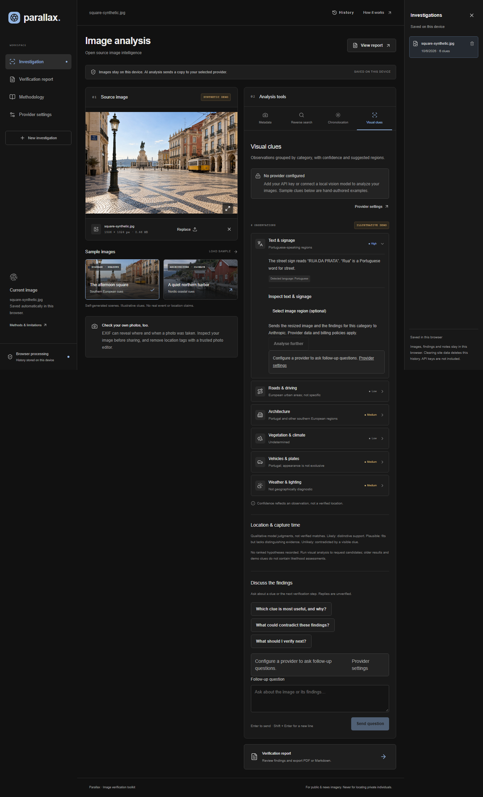

# Parallax

**Open source image intelligence**

A browser-first OSINT workspace for verifying public and news imagery. Built with Next.js App Router, TypeScript and Tailwind CSS.



## Public instance

**Visual analysis uses your own provider configuration.** Metadata, searches, shadows, history and exports work without keys or accounts:

- Drag-and-drop or file-picker upload of JPEG, PNG and WebP images, up to 20 MB / 60 megapixels.
- Browser-only EXIF/XMP inspection using exifr: camera, timestamps, software, GPS, and SHA-256 file fingerprint.
- Optional GPS map, loaded only after a click because map requests disclose coordinates to OpenStreetMap.
- Google Lens, Bing Visual Search, Yandex Images and TinEye handoffs. Local files must be selected again at the provider; optional public image URLs are passed directly.
- Shadow direction measurements and SunCalc time hypotheses, with explicit coordinate, date, UTC offset, north reference and perspective assumptions.
- Verification reports with editable investigator notes and local PDF / Markdown downloads.
- Anthropic, OpenAI, Gemini, local and OpenAI-compatible vision providers configured in the UI; save/load a JSON file containing provider keys.
- Local investigation history with automatic saves, reopen and delete controls.
- Two self-generated synthetic samples with hand-authored illustrative visual clues.
- Responsive dark interface, `/methodology`, generated Open Graph image and link metadata.

There is no signup, server image database or analytics. Investigations (including original images, findings, measurements and notes) are saved in this browser using IndexedDB. Reopen them from the right-hand History pane. Clearing site data deletes history; this is not a cross-device backup. Reports include metadata and notes, but do not embed the source image or API keys.

## Run locally

Use Node.js 22 LTS or newer supported LTS and npm.

```sh
npm ci
cp .env.example .env.local
npm run dev
```

PowerShell: `Copy-Item .env.example .env.local`.

Open <http://localhost:3000>. No environment variables are required for the public feature set.

```sh
npm run lint
npm test
npm run build
npm start
```

Browser integration tests:

```sh
npx playwright install chromium
npm run test:e2e
```

Browser tests cover uploads, EXIF/GPS, reverse-search links, shadows, report downloads, responsive layout, accessibility, the New investigation file picker, config-file round trips, provider routing, and history restore/delete across reloads. Unit tests cover solar geometry, provider request/response formats, validation and rate limiting. Provider tests use mocked responses and dummy credentials; live paid API calls are not made in CI.

## Provider settings

Open **Provider settings**, select a provider, enter its model ID and key, then click **Save settings**. In **Visual clues**, consent to sending the image and click **Analyze visual clues**. The selected model must support image input and JSON output.

- **Anthropic / OpenAI / Gemini:** keys and resized images pass through `/api/analyze` to fixed official provider hosts. Credentials are never taken from owner environment variables, logged, saved server-side or returned in responses. Provider billing and retention policies apply.
- **Local server:** requests go directly from your browser to a loopback OpenAI-compatible endpoint. Default: `http://localhost:11434/v1`, model `llama3.2-vision`. Pull the model in Ollama and configure `OLLAMA_ORIGINS` to allow the Parallax origin. LM Studio works with its vision model loaded, OpenAI-compatible server started, and CORS enabled.
- **OpenAI-compatible:** enter an HTTPS API base URL and model. These requests also go directly from the browser, so the endpoint must allow CORS. Only localhost/loopback may use plain HTTP. The server-side proxy does not accept custom destinations.

**Save config file (includes keys)** downloads all provider profiles to `parallax-provider-config.json`. This file is unencrypted and includes keys in plain text. **Load config file** validates the file and lets you review its endpoint before applying it. Keep it private and out of Git; its standard filename is ignored. **Save settings** saves all profiles (including keys) in this browser localStorage, scoped to the app base path. Settings restore on reload and on reopening the site in the same browser. Browser storage is unencrypted and separate from investigation history; clearing site data removes both. **Clear keys & settings** removes saved provider settings and resets the active tab, not previously downloaded files or other open tabs. Storage failures are reported in Settings; the active tab can still use its settings. No provider key is written to the project directory or Git.

Browser local-network permission or HTTPS/mixed-content restrictions may affect local endpoints. Use a locally served Parallax instance or an HTTPS endpoint if your browser blocks access. Connection errors describe these requirements. Applying settings validates configuration, not credentials; credentials are checked by the provider when you run analysis.

## Environment variables

| Variable                         | Default                    | Purpose                                                                                           |
| -------------------------------- | -------------------------- | ------------------------------------------------------------------------------------------------- |
| `BASE_PATH`                      | empty                      | Build-time prefix such as `/projects/parallax`; rebuild after changing.                           |
| `NEXT_PUBLIC_SITE_URL`           | Vercel origin or localhost | Optional origin override for social previews.                                                     |
| `DISABLE_CLOUD_AI`               | `false`                    | Optional operator switch to reject cloud-proxy requests. Local connections still work directly.   |
| `UPSTASH_REDIS_REST_URL`         | unset                      | Optional distributed rate-limit Redis REST endpoint.                                              |
| `UPSTASH_REDIS_REST_TOKEN`       | unset                      | Server-only Redis token.                                                                          |
| `RATE_LIMIT_SALT`                | unset                      | Random secret for hashing client IPs when using Redis.                                            |
| `REQUIRE_DISTRIBUTED_RATE_LIMIT` | `false`                    | Fail closed if distributed limiting is not configured. Recommended for larger public deployments. |

No provider API key belongs in the server environment. `.env*` is ignored except `.env.example`.

## Deploy to Vercel

1. Push this repository to GitHub and import it into Vercel.
2. Use Vercel's detected Next.js preset and default install/build settings. No `vercel.json` or code changes are needed.
3. Social previews use Vercel's provided origin automatically; optionally set `NEXT_PUBLIC_SITE_URL` when using a custom domain. Visitors supply their own provider keys in the UI.
4. Deploy. Metadata, demos, reverse search, chronolocation and export do not need a paid API.

For a subpath, set `BASE_PATH=/projects/parallax` **before building**, then rebuild. Next links, sample images, API requests, fonts and social previews respect this prefix. If a separate personal website owns the domain, configure that site's routing/reverse proxy to forward this path to the Vercel app. A base path does not configure another site's proxy automatically. See [Next.js basePath](https://nextjs.org/docs/app/api-reference/config/next-config-js/basePath).

To test a subpath in PowerShell:

```powershell
$env:BASE_PATH='/projects/parallax'
npm run build
npm start
# Open http://localhost:3000/projects/parallax
```

## API and privacy implementation

The browser resizes an analysis image to at most 1568 pixels on its longest edge and re-encodes it as JPEG, stripping metadata. The cloud route validates provider/model/image fields, bounds request size, checks origin, and forwards visitor credentials only to the selected official API. It enforces a 45-second provider timeout, rejects redirects, validates all six clue categories, returns generic credential-safe errors, and sets `Cache-Control: no-store`. The app does not log credentials or images. Do not add request-body or authorization-header logging in deployment middleware.

Cloud requests are limited to 5 per 10 minutes per IP on Vercel, using its trusted forwarded-IP header. With all three Redis variables configured, the limiter is distributed and stores only salted IP hashes and counters. Otherwise the fallback is per-instance memory and resets on cold starts; it is not a deployment-wide limit. `REQUIRE_DISTRIBUTED_RATE_LIMIT=true` fails closed when Redis is missing. Non-Vercel deployments use a shared bucket until you adapt trusted-proxy handling. Direct local/compatible requests use the destination's limits.

Investigation history is local IndexedDB storage. It includes uploaded image bytes and parsed metadata, but no provider keys. New investigation preserves the previous case, resets tool state, and opens the picker. Local storage can be evicted by the browser; export important reports. Saved provider JSON files are separate, opt-in, and unencrypted.

## Chronolocation assumptions

Coordinates are entered directly. Mark the object's base, its top and the tip of its ground shadow; keyboard point entry is also supported. Enter the direction of north clockwise from image-up. The algorithm corrects for image aspect ratio and compares the base-to-shadow-tip bearing with the opposite solar azimuth at one-minute intervals across the candidate local date. It reports the best match, predicted sun altitude/azimuth, and the number and bounds of matching minute samples. The earliest/latest matches may not form a continuous interval.

**The ground plane must be rectified to a top-down view with independently known north.** Ordinary oblique photos distort bearings; this app does not perform perspective rectification. Object height is not inferred from pixels. The object-top point is recorded for context only. Sloped terrain, leaning objects, artificial illumination and uncertain endpoints can invalidate results. One-minute sampling is computational resolution, not a claim of one-minute accuracy. SunCalc is pinned to 1.9.0 because later versions change angular conventions.

## Project structure

```text
src/app/                 Routes, layout, styles and Open Graph image
src/app/api/analyze/     BYOK cloud provider proxy
src/components/         Workspace, provider settings and investigation history
src/lib/                EXIF, schemas, solar geometry, reports and rate limiting
public/samples/          Bundled synthetic demo JPEGs
public/fonts/            Self-hosted PDF font and its OFL license
tests/                  Unit and browser integration tests
docs/                   Screenshots and sample provenance
```

## References and scope

The interface uses task-oriented labels informed by [Forensically](https://29a.ch/photo-forensics/) and [SunCalc](https://www.suncalc.org/). [Bellingcat's toolkit](https://bellingcat.gitbook.io/toolkit) is a useful reference for corroboration workflows. Parallax is not affiliated with these projects. It does not implement error-level analysis, image authentication or automated geolocation.

Use only for public and news imagery, not locating private individuals. Check your own photos for GPS leaks before sharing. See `/methodology` for technique-specific limitations and [sample provenance](docs/SAMPLES.md) for the generated assets.

MIT licensed source; Noto Sans uses the SIL Open Font License in `public/fonts/OFL.txt`. Synthetic scenes are provided as project demo assets, not documentary evidence.

### Follow-up questions

After loading visual clues, use **Discuss the findings** to ask about observations or next verification steps. It uses the provider selected in Settings (Anthropic, OpenAI, Gemini, local, or compatible). Each explicit Send shares the metadata-stripped image, current findings, and up to five recent exchanges. Replies are unverified and have no live web-search access. The complete conversation is saved with the investigation in browser IndexedDB and included in Markdown/PDF exports. Keys are excluded. Cloud chat and analysis share the request rate limit; local endpoints run directly from the browser.

### Focused inspection and hypotheses

Each visual-clue category has an **Analyse further** action with its own saved conversation. Optional two-corner selection or percentage controls crop a detail directly from the original image before resizing and stripping metadata. This preserves available local detail that an overview can lose; it does not create missing pixels. OpenAI cloud requests explicitly use high image detail. Local/compatible requests omit that provider-specific setting.

The overview prompt asks for visible diagnostic features, tentative identifications, alternatives, geographic usefulness and verification checks. New analyses can return ranked location and capture-time hypotheses. Candidates use Likely, Plausible or Unlikely with supporting evidence and an unresolved explanation. These are qualitative judgments, not verified matches; the app has no automated map or web corroboration. If no calendar date is defensible, the model should explain that it is unresolved. Saved older results and demos remain usable without these optional fields. Category conversations and candidate assessments are included in report exports.
